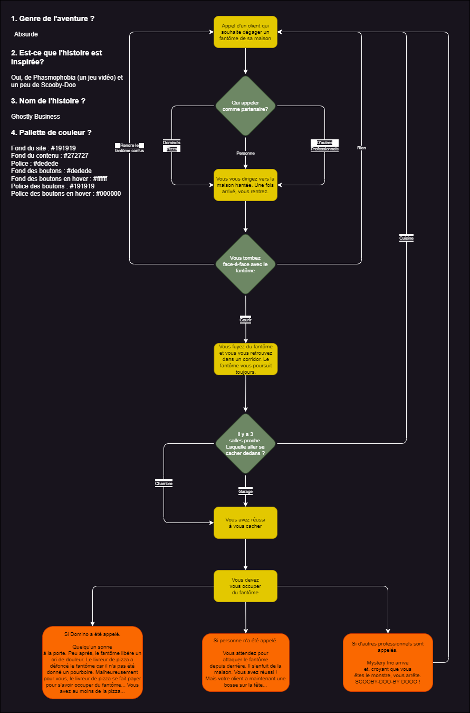

# Ghostly Business
Projet de session du cours Développement Web

## Schéma

### Genre de l'aventure ?
Absurde
   
### Inspirations
Phasmophobia, un peu de Scooby-Doo et The Henry Stickmin Collection

### Nom de l'histoire
Ghostly Business

### Pallette de couleur
Fond du site : #191919
Fond du contenu : #272727
Police : #dedede
Fond des boutons : #dedede
Fond des boutons en hover : #ffffff
Police des boutons : #191919
Police des boutons en hover : #000000

## Assets
Contient les image et fonts utilisés dans le projet.

## index.html
Le HTML du projet.

## styles.css
Le CSS du projet.
